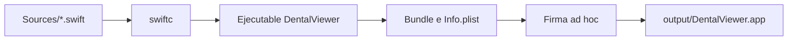
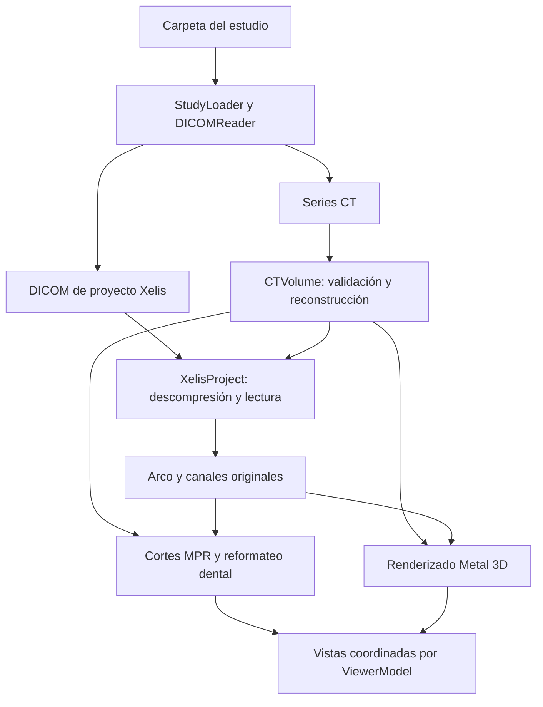

# DentalViewer para macOS

Visor nativo de estudios CT/CBCT DICOM, con reconstrucción multiplanar, panorámica dental, visualización 3D y planificación manual. Importa la curva dental y los canales mandibulares guardados en proyectos Xelis compatibles.

## Para desarrolladores

### Tecnologías y requisitos

Requiere **macOS 13 o posterior**, herramientas de línea de comandos de Xcode y una GPU compatible con Metal.

| Tecnología | Uso |
| --- | --- |
| Swift, compilado en modo Swift 5 | Aplicación, lectura de archivos y cálculos geométricos. |
| AppKit | Inicio de la aplicación, ventanas, eventos del mouse y vistas de imagen. |
| SwiftUI | Controles, barra lateral y composición de la interfaz. |
| Metal y MetalKit | Renderizado del volumen y de las superposiciones 3D. |
| CoreGraphics y SIMD | Imágenes de cortes, coordenadas físicas y operaciones vectoriales. |
| zlib del sistema | Descompresión y verificación CRC del payload Xelis. |

### Estructura del proyecto

```text
Sources/
  App.swift                  Inicio de AppKit y ventana principal
  ViewerModel.swift          Estado compartido y coordinación de carga
  DICOM.swift                Lectura DICOM y agrupación de series
  Volume.swift               Volumen CT, intensidades y cortes MPR
  XelisProject.swift         Importación de curvas y canales originales
  DentalReformat.swift       Curva dental, panorámica y transversales
  CanalGeometry.swift        Geometría de canales manuales
  CanalReformat.swift        Planos de revisión del canal
  Planning.swift             Implantes, canales y persistencia del plan
  Measurements.swift         Geometría y dibujo de mediciones
  DentalInteractions.swift   Interacción sobre las vistas dentales
  DentalWorkspace.swift      Distribución y dibujo de paneles dentales
  SliceView.swift            Vista e interacción de cortes MPR
  VolumeRenderer.swift       Renderizado Metal
  VolumeRotation.swift       Rotación 3D
  XelisOverlays.swift        Superposiciones de trazados originales
  PanelPresentation.swift    Ampliación de paneles y tamaño de ventana
  PlanningUI.swift           Controles de planificación
  CanalReviewView.swift      Interfaz de revisión del canal
Tests/main.swift             Suite ejecutable y fixtures sintéticos
scripts/build.sh            Compilación y creación del bundle
scripts/test.sh             Compilación y ejecución de pruebas
tools/audit_panoramic_scale.py  Auditoría geométrica independiente
output/                     Bundles, cachés y resultados locales
```

### Compilación y ejecución

Desde la raíz del repositorio:

```sh
bash scripts/build.sh
open output/DentalViewer.app
```

El script compila `Sources/*.swift` con `swiftc`, optimización `-O` y destino macOS 13 para la arquitectura de la máquina. Crea el bundle, genera su `Info.plist` y aplica una firma ad hoc. El flujo de compilación se gestiona con los scripts del repositorio.



### Pipeline de importación y visualización

`ViewerModel` coordina la carga y mantiene el estado que comparten las vistas. La exploración de archivos y la construcción del volumen se ejecutan en segundo plano; los resultados se aplican en el hilo principal. Cada carga tiene un identificador que permite descartar resultados de una solicitud anterior.



El volumen conserva origen y espaciado DICOM en coordenadas **LPS**, con distancias expresadas en milímetros. El lector Xelis verifica versión, CRC, referencias a los cortes y límites físicos antes de trasladar las coordenadas locales al espacio del volumen.

La panorámica se calcula de forma asíncrona. Durante un cambio de profundidad se conserva el cuadro anterior junto con su geometría; al completar el cálculo se reemplazan juntos la imagen, la escala y las superposiciones. Las solicitudes superadas se cancelan.

### Pruebas y auditoría

```sh
bash scripts/test.sh
# Integración opcional con un estudio Xelis compatible local:
bash scripts/test.sh "/ruta/al/estudio"
```

La suite usa aserciones propias en `Tests/main.swift`. El script compila las fuentes junto con las pruebas, excluyendo el punto de entrada de la aplicación, y genera `output/viewer-tests`.

Las pruebas sintéticas cubren lectura DICOM, intensidades, geometría, rotación, mediciones, planificación y estados de interacción. La ejecución con un estudio agrega comprobaciones de importación Xelis, conservación de coordenadas, superposiciones y paneles redimensionados. También se comprueba el shader Metal cuando hay un dispositivo disponible en el entorno CLI; el renderizado y la interacción se verifican abriendo la app.

El auditor Python lee un payload Xelis previamente extraído y calcula longitudes independientemente del código Swift:

```sh
python3 tools/audit_panoramic_scale.py /ruta/al/project-payload.bin
```

El método y sus límites se describen en [AUDITORIA-ESCALA-PANORAMICA.md](AUDITORIA-ESCALA-PANORAMICA.md).

### Formatos y compatibilidad técnica

| Entrada o salida | Compatibilidad |
| --- | --- |
| CT/CBCT DICOM | Imágenes monocromáticas, axiales LPS, uniformemente espaciadas, de 8 o 16 bits, con píxeles sin compresión. Se verifican cortes faltantes o duplicados, geometría e intensidades. |
| Proyecto Xelis | Curva dental y colección de canales de **Lucion/Xelis 1.0.6.4 BN2(P)**; snapshot `30000001` y payload `30000017`. El bloque de proyecto se lee independientemente de su imagen de presentación JPEG. |
| Planificación propia | Archivo `.dentalplan.json`, validado contra la serie y la geometría del volumen. El formato v2 conserva las propiedades actuales y admite planes v1. |
| Capturas | PNG de la ventana. |

La planificación manual admite hasta 100 implantes, 10 canales y 256 elementos 3D en total; cada implante o segmento de canal cuenta como un elemento. Los canales originales importados conservan sus segmentos completos.

## Para odontólogos

### Abrir y explorar un estudio

Abrí `output/DentalViewer.app` y seleccioná la carpeta completa del estudio o su carpeta `Data`. La aplicación recuerda la última carpeta abierta y lee los archivos originales sin modificarlos.

La vista **Dental** reúne nueve secciones transversales, una panorámica, un corte axial, la vista 3D y controles de histograma y contraste. Las flechas de cada encabezado permiten ampliar un panel y restaurar la distribución conservando encuadre y mediciones. También puede ampliarse una sección transversal individual. La ventana admite un mínimo de **1080 × 720 puntos**.

### Funcionalidades

| Herramienta | Qué permite hacer |
| --- | --- |
| MPR | Consultar planos axial, coronal y sagital sincronizados. Un clic mueve la referencia; la rueda avanza cortes; ⌘ + rueda o pellizcar cambia zoom; ⌥ + arrastrar desplaza la imagen. |
| Panorámica dental | Recorrer el arco con clic, rueda o deslizador. Configurar el paso y el campo de las secciones transversales. |
| Profundidad y espesor | Desplazar la superficie panorámica de −10 a +10 mm y ajustar el espesor promediado de 0 a 10 mm. La axial muestra en cian la superficie y los límites del espesor. Los botones permiten pasos de 0.1 mm; ⇧ + rueda también cambia profundidad. |
| Vista 3D | Rotar arrastrando, cambiar zoom con la rueda y restablecer con doble clic. |
| Contraste | Ajustar centro y ventana mediante controles, presets o arrastre: vertical para Centro y horizontal para Ventana. |
| Medir | Arrastrar entre dos puntos en MPR, panorámica o transversales, también con el panel ampliado. Se muestra una línea amarilla y su longitud en milímetros. |
| Canales originales | Visualizar en verde los trazados guardados de Xelis en 3D, MPR, transversales y panorámica. Elegir un canal centra los cortes; **Recorrer canal original** abre su revisión perpendicular y longitudinal. |
| Curva dental | Definir manualmente un arco en axial cuando el estudio requiere una curva propia. En proyectos compatibles se utiliza la curva original guardada. |
| Planificación manual | Colocar y mover implantes cilíndricos genéricos, crear canales por puntos, editar o insertar controles, deshacer y rehacer, y revisar el recorrido. |
| Guardar plan / Cargar plan | Conservar la planificación manual en `.dentalplan.json`. Guardá antes de cerrar; los trazados originales se recuperan del proyecto al abrir el estudio. |
| Captura | Guardar un PNG de la ventana. |

Las mediciones permanecen durante la sesión y se eliminan desde **MEDICIONES**. Redefinir la curva invalida las medidas ligadas a ella; cambiar profundidad borra las medidas panorámicas de la superficie anterior.

### Mediciones y precisión

Las distancias se calculan con el espaciado físico DICOM. En los cortes transversales se usa la distancia entre los extremos dentro del plano de sección, incluidos los ejes inclinados guardados.

En panorámica, la componente horizontal mide el **recorrido del arco desplegado** y la vertical usa el espaciado entre cortes. Una diagonal combina ambas componentes sobre esa imagen desplegada. La regla inferior indica **Recorrido del arco · mm** y la barra vertical representa **10 mm**. La numeración de secciones de Xelis es una referencia distinta.

Las medidas se muestran con dos decimales. Esa presentación no establece una exactitud clínica de 0.01 mm: el resultado depende de la resolución del estudio, de la superficie elegida y de la colocación de los extremos. Las pruebas con geometría sintética verifican cálculos y consistencia al redimensionar; las comparaciones de pantalla tienen incertidumbre por selección de píxeles, redondeo y ajustes del visor. El alcance de esas comprobaciones está documentado en la [auditoría de escala](AUDITORIA-ESCALA-PANORAMICA.md).

Los canales importados conservan sus muestras y controles originales. Su grosor verde es un estilo de dibujo, independiente del diámetro anatómico. El 3D representa una superficie de umbral sobre una copia reducida del CT de hasta 320 muestras por eje; los cortes se generan a partir del volumen original. Los trazados se superponen al hueso para mantenerlos visibles.

### Alcance actual

DentalViewer es un **prototipo de visualización sin validación diagnóstica o quirúrgica**. La separación entre implantes y canales es una aproximación geométrica aplicada a los trazados manuales; su interpretación requiere evaluación clínica y todavía debe extenderse a los canales originales importados.

La importación Xelis recupera el arco y los canales compatibles. Queda pendiente incorporar todos los ajustes, anotaciones, máscaras, implantes y bibliotecas del proyecto. Los implantes disponibles son cilindros genéricos.

Más información sobre los [canales mandibulares](CANAL-MANDIBULAR.md) y el [estado de funcionalidades](FUNCIONALIDADES-PENDIENTES-XELIS.md).
